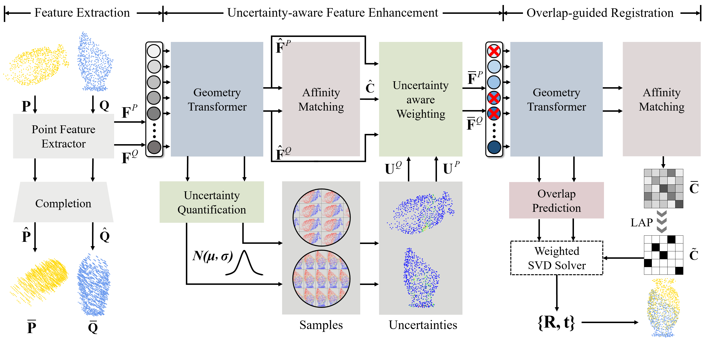

# UTOPIC: Uncertainty-aware Overlap Prediction Network for Partial Point Cloud Registration

PyTorch implementation of the paper:

UTOPIC: Uncertainty-aware Overlap Prediction Network for Partial Point Cloud Registration.

## Introduction

High-confidence overlap prediction and accurate correspondences are critical for cutting-edge models to align paired point clouds in a partial-to-partial manner. However, there inherently exists uncertainty between the overlapping and non-overlapping regions, which has always been neglected and significantly affects the registration performance. Beyond the current wisdom, we propose a novel uncertainty-aware overlap prediction network, dubbed UTOPIC, to tackle the ambiguous overlap prediction problem; to our knowledge, this is the first to explicitly introduce overlap uncertainty to point cloud registration. Moreover, we induce the feature extractor to implicitly perceive the shape knowledge through a completion decoder, and present a geometric relation embedding for Transformer to obtain transformation-invariant geometry-aware feature representations. With the merits of more reliable overlap scores and more precise dense correspondences, UTOPIC can achieve stable and accurate registration results, even for the inputs with limited overlapping areas. Extensive quantitative and qualitative experiments on synthetic and real benchmarks demonstrate the superiority of our approach over state-of-the-art methods.



## Prerequisite

Please use the following command for installation.

```
# Create a new environment
conda create -n utopic python==3.8.5
conda activate utopic

# [Optional] You can choose the suitable pytorch version according to your cuda version.
pip install torch==1.8.0+cu111 torchvision==0.9.0+cu111 torchaudio==0.8.0 -f https://download.pytorch.org/whl/torch_stable.html

# Install packages and other dependencies
pip install -r requirements.txt
cd extensions/Chamfer3D
python setup.py install
```

## Pre-trained Weights

We provide pre-trained weights on ModeNet40 under the setting of RPM-Crop(0.7) and RPM-Crop(0.5) in the [release]() page. Please download the latest weights and put it in `weights` directory.

## ModelNet

### Data preparation

Download the [data](https://shapenet.cs.stanford.edu/media/modelnet40_ply_hdf5_2048.zip). The data should be put in `data` directory.

### Training

Please use the following command for training.

```
python train.py --cfg experiments/UTOPIC_Unseen_CropRPM_0.7_modelnet40.yaml
```

### Testing

Please use the following command for testing.

```
python eval.py --cfg experiments/UTOPIC_Unseen_CropRPM_0.7_modelnet40.yaml
```

## Results

### ModelNet

We evaluate UTOPIC on ModelNet with two cropping settings:

1. Standard setting: [0.7, 0.7] cropping ratio (average), unseen categories.
2. Low-overlap setting: [0.5, 0.5] cropping ratio (average), unseen categories.

We use the data augmentation in [RGM](https://arxiv.org/abs/2103.04256) which is similar to [RPMNet](https://arxiv.org/abs/2003.13479) and more difficult than [PRNet](https://arxiv.org/abs/1910.12240).

| Benchmark      | RMSE(R) | MAE(R) | RMSE(t) | MAE(t) | Error(R) | Error(t) |
| :------------- | :---: | :---: | :---: | :---: | :---: | :---: |
| ModelNet (0.7)  | 0.2238 | 0.1322 | 0.00212 | 0.00131 | 0.2464 | 0.00264 |
| ModelLoNet (0.5) | 2.5463 | 0.8588 | 0.02098 | 0.00765 | 1.5934 | 0.01555 |


## Acknowledgements

- [RPMNet](https://github.com/yewzijian/RPMNet)
- [RGM](https://github.com/fukexue/RGM)
- [GeoTransformer](https://github.com/qinzheng93/GeoTransformer)
- [PCN](https://github.com/qinglew/PCN-PyTorch)
- [UGTR](https://github.com/fanyang587/UGTR)
